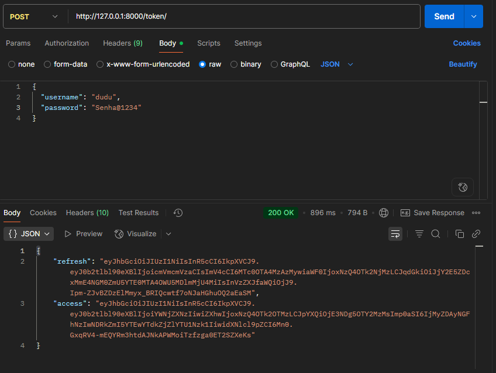

# 🧩 Task Manager API

Uma API REST construída com Django e Django REST Framework para gerenciamento de equipes e tarefas, com autenticação via JWT e permissões personalizadas.

---

## 📌 Funcionalidades

- ✅ Cadastro de equipes com líder e membros
- ✅ Criação e atribuição de tarefas a usuários
- ✅ Visualização de tarefas apenas por membros da equipe
- ✅ Conclusão de tarefas apenas pelo responsável
- ✅ Autenticação via JWT

---

## 🚀 Tecnologias

- Python 3.12
- Django 5.2
- Django REST Framework
- SimpleJWT (autenticação)
- SQLite (default para testes)

---

Este endpoint permite que o usuário faça login e receba um token de autenticação JWT, necessário para acessar os endpoints protegidos da API.


## ⚙️ Instalação e execução local

```bash
git clone https://github.com/Drupin0-0/task-manager-api.git
cd task-manager-api

python -m venv venv
source venv/bin/activate  # Windows: venv\Scripts\activate

pip install -r requirements.txt

python manage.py migrate
python manage.py createsuperuser  # Para acessar o admin

python manage.py runserver


